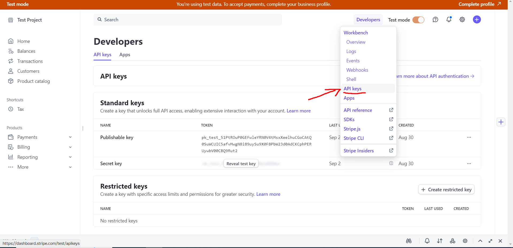
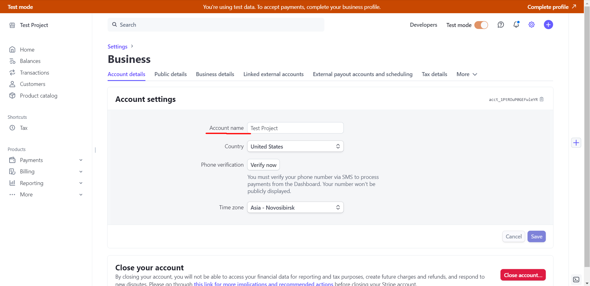
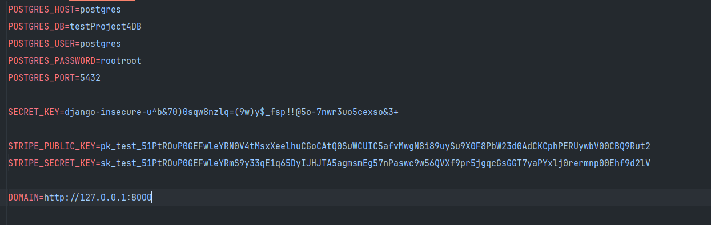
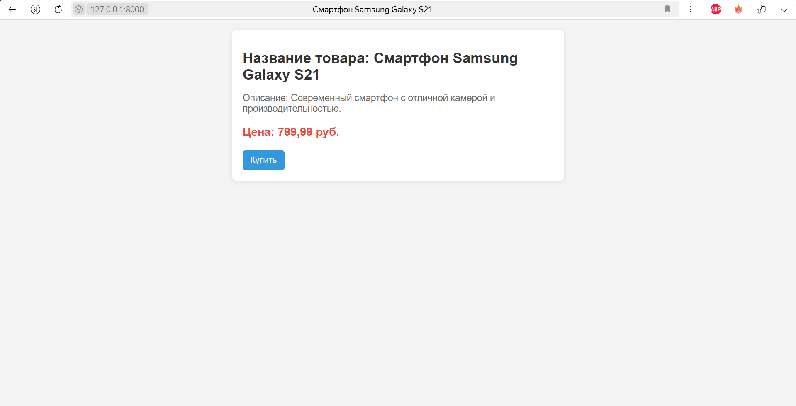
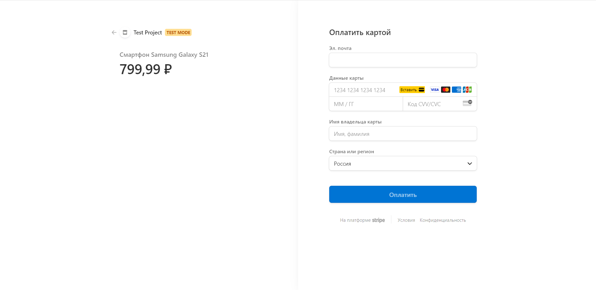
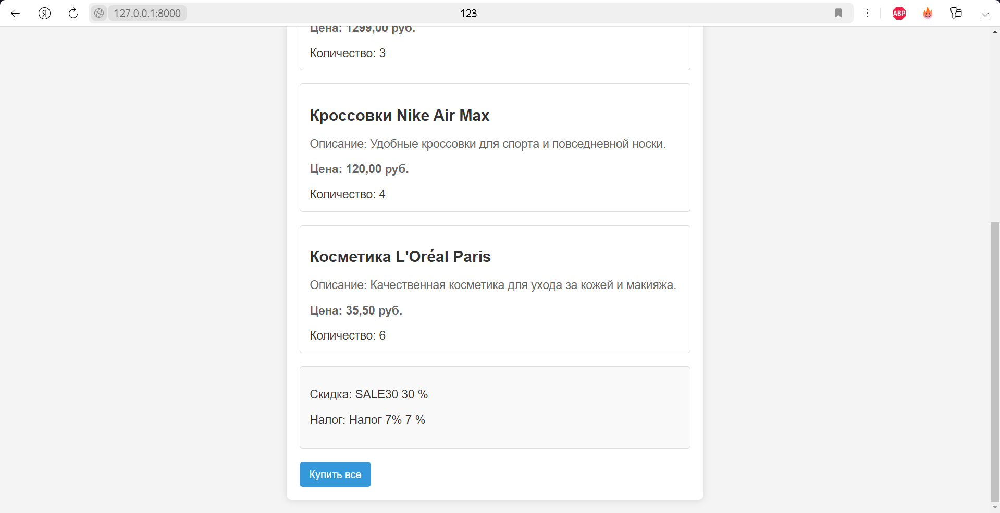
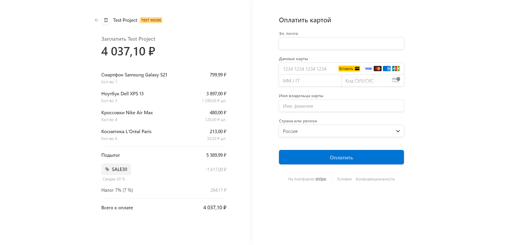

# Тестовое задание

## Формулировка задания

Задача
- Реализовать Django + Stripe API бэкенд со следующим функционалом и условиями:
- Django Модель Item с полями (name, description, price)
- API с двумя методами:
- GET /buy/{id}, c помощью которого можно получить Stripe Session Id для оплаты выбранного Item. При выполнении этого метода c бэкенда с помощью python библиотеки stripe должен выполняться запрос stripe.checkout.Session.create(...) и полученный session.id выдаваться в результате запроса
- GET /item/{id}, c помощью которого можно получить простейшую HTML страницу, на которой будет информация о выбранном Item и кнопка Buy. По нажатию на кнопку Buy должен происходить запрос на /buy/{id}, получение session_id и далее с помощью JS библиотеки Stripe происходить редирект на Checkout форму stripe.redirectToCheckout(sessionId=session_id)

Реализованные Доп. Задания: 
- Запуск используя Docker
- Использование environment variables
- Просмотр Django Моделей в Django Admin панели
- Модель Order, в которой можно объединить несколько Item и сделать платёж в Stripe на содержимое Order c общей стоимостью всех Items
- Модели Discount, Tax, которые можно прикрепить к модели Order и связать с соответствующими атрибутами при создании платежа в Stripe - в таком случае они корректно отображаются в Stripe Checkout форме.

Критерии оценки
- Работоспособность
- Чистота и структура куда
- Гибкость и масштабируемость
- Безопасность и обработка ошибок

Доп плюсы:
- использование улучшающих архитектуру проекта, его читаемость, расширяемость и тестируемость паттернов и шаблонов проектирования
- использование более удобных библиотек и технологий, позволяющих ускорить разработку и сделать проект лучше
- скрипт или некий функционал для наполнения БД тестовыми данными
- типизация кода, докстринги
- написание readme по всем нюансам и способам запуска

## Старт

1. Клонирование репозитория: Откройте свой терминал и перейдите в каталог, в котором вы хотите сохранить проект. Используйте git clone команду для клонирования репозитория:
```git clone https://github.com/KirillPleshkov/testProject4.git```

2. Перейдите в каталог проекта:
```cd testProject4```

3. Убедитесь, что Docker установлен на вашем компьютере. Вы можете скачать его с [официального сайта Docker](https://www.docker.com/get-started/).

4. Создайте и настройте аккаунт Stripe и получите публичный и секретный ключи. Более подробная информация в разделе "Настройка Stripe"

5. Создайте .env-файл и заполните его. Более подробная информация в разделе "ENV файл".

6. При необходимости исправьте docker-compose.yml файл.

7. Поднимите Docker контейнер.
```docker-compose up```

8. Создайте суперпользователя.
```python manage.py createsuperuser```

9. *опционально* Заполните БД тестовыми данными.
```python manage.py init_items test_items```

После этого ваше приложение будет доступно по адресу http://localhost:8000.

## Настройка Stripe

1. Перейдите на официальную страницу [Stripe](https://stripe.com/).

2. Зарегистрируйтесь или авторизуйтесь в аккаунт. (Нужно выбрать регион, России там нет поэтому выбираем любой другой).

3. Далее переходим на страницу с API ключами. Там получаем секретный и публичный ключи, которые мы далее добавим .env файл. 

4. Далее можем перейти на [страницу настройки](https://dashboard.stripe.com/test/settings/account), где можем поменять название аккаунта.


На этом основные настройки Stripe закончились.

## ENV файл

Шаблон ENV файла с комментариями:

POSTGRES_HOST=postgres (Для docker оставить таким)

POSTGRES_DB=testProject4DB (название таблицы в БД)

POSTGRES_USER=postgres (name пользователя postgres)

POSTGRES_PASSWORD=rootroot (password пользователя postgres)

POSTGRES_PORT=5432 (порт postgres)

SECRET_KEY=<SECRET_KEY> (сгенерируйте секретный ключ)

STRIPE_PUBLIC_KEY=pk_test_... (получили после регистрации Stripe аккаунта)

STRIPE_SECRET_KEY=sk_test_5... (получили после регистрации Stripe аккаунта)

DOMAIN=http://127.0.0.1:8000 (домен где расположен backend, скорее всего оставить таким)

Пример моего .env файла


## Описание

Данный проект представляет собой бэкенд-приложение, разработанное с использованием Django и интегрированное с API Stripe для обработки платежей. 
Основная цель проекта — предоставить пользователям возможность просматривать товары и осуществлять покупки через безопасную платформу Stripe.

## Тестирование

Для начала надо заполнить БД. Для этого можно воспользоваться командой, автоматически заполняющей тестовыми Item и Order.
Также можно воспользоваться админ-панелью и заполнить своими данными. В админ панели можно создать item, discount, tax и order(к которому можно привязать ранее перечисленные).


Перейдя на страницу item/<item_id>/, попадаем на страницу предмета. 
Там есть вся информация о нем и кнопка "Купить" которая отправляет запрос на путь buy/<item_id>/, для получения stripe checkout сессии и дальнейшего редиректа на страницу оплаты.



Перейдя на страницу order/<order_id>/, попадаем на страницу заказа.
Там расположен список items, скидка и налог на этот заказ. Есть также кнопка "Купить все" которая предназначена для перехода на страницу покупки. 
На этой странице указаны все предметы, налог и скидка.



Для тестовой оплаты нужно использовать карту: 4242 4242 4242 4242.

Отследить все транзакции можно на странице [Stripe](https://dashboard.stripe.com/test/payments).

Создание, обновление и удаление [discount](https://dashboard.stripe.com/test/coupons) и [tax](https://dashboard.stripe.com/test/tax-rates), тесно связано с Stripe.
Каждое изменение в БД отражается на объекты Stripe.

Также есть скрипт init_items для наполнения БД тестовыми Items.
